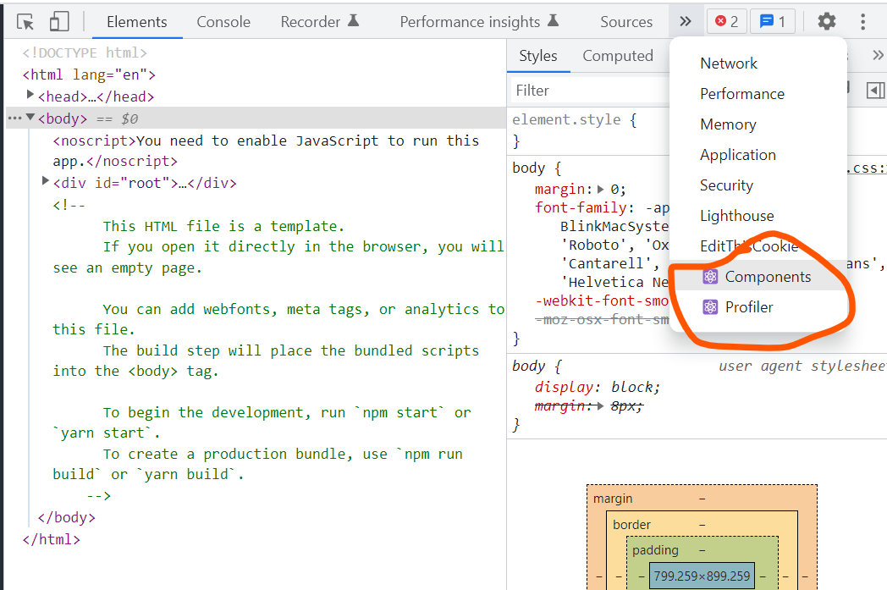
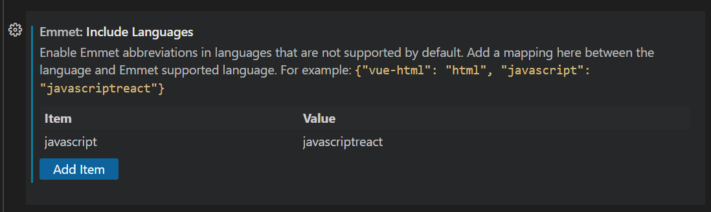
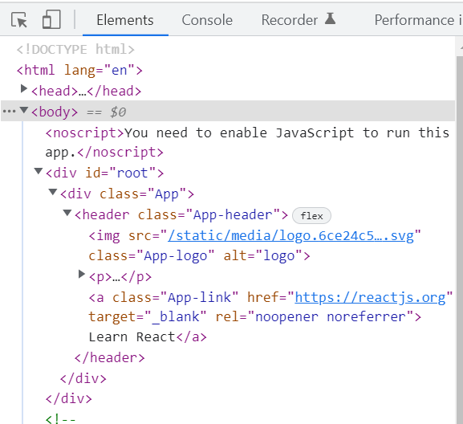
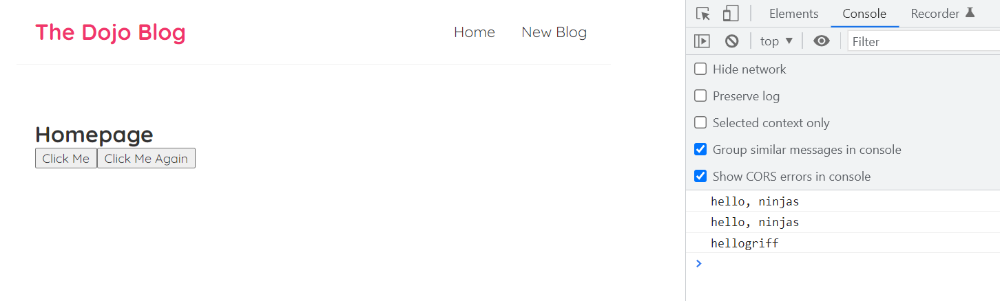
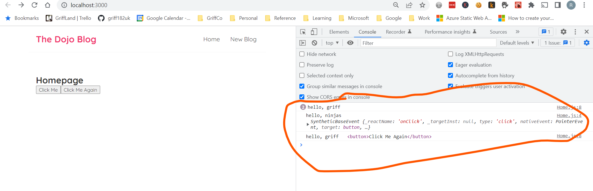
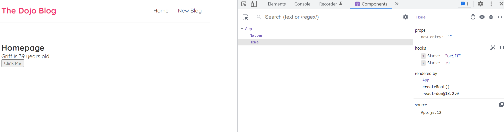

* [Course Walkthrough](https://www.youtube.com/playlist?list=PL4cUxeGkcC9gZD-Tvwfod2gaISzfRiP9d)
* [github](https://github.com/iamshaunjp/Complete-React-Tutorial)
* [Json Server Videos](https://www.youtube.com/watch?v=mAqYJF-yxO8&list=PL4cUxeGkcC9i2v2ZqJgydXIcRq_ZizIdD&index=1&t=0s)
* [Json Server blog](https://medium.com/codingthesmartway-com-blog/create-a-rest-api-with-json-server-36da8680136d)
* [Environment Files](https://trekinbami.medium.com/using-environment-variables-in-react-6b0a99d83cf5)
* [Simple CRUD React Json Server](https://medium.com/weekly-webtips/use-react-with-json-server-and-create-simple-crud-app-b2bf58cd4558)
* [Generte Mock Json Data](https://itnext.io/how-to-generate-mock-data-using-faker-js-and-json-server-1d17007a08e4)

## Requirements

* [VS Code]()
* [Simple React Snippets](https://marketplace.visualstudio.com/items?itemName=burkeholland.simple-react-snippets)
* [Node JS](https://nodejs.org/en/download/)
* [React Dev Tools](https://reactjs.org/blog/2015/09/02/new-react-developer-tools.html#installation)



##

## Setup

In VS code to enable javascript in emmet.
This allows template and shortcut creation in react and javascript.



## Commands

* Check version of node and that installed.
* Ensure have current version

```bash
node -v
```

* [Can run create react boilerplate then](https://reactjs.org/docs/create-a-new-react-app.html)

```bash
npx create-react-app {app-name}
```

* to start react app, ensure in correct directory...

```bash
npm run start
```

* to install node modules as not part of source (excluded in gitignore). This will install packages from package.json (think like requirements.txt)

```bash
npm install
```

## React Structure

* Remember react is essentially a single page app framework
* {app-name}/public/index.html has this, which links to 'root' in second one

```html
<div id="root"></div>
```

* Which links to src/index.js, which has this, with the '<App>' tag referencing app in the third part.

```javascript
const root = ReactDOM.createRoot(document.getElementById('root'));
root.render(
  <React.StrictMode>
    <App />
  </React.StrictMode>
);

```

* Which links to the underlying app src/App.js which has this

```javascript
function App() {
  return (
    <div className="App">
    ...
```

* The above then injects html into the original index.html. "className" is used as class is reserved keyword in javascript. When look at page once rendered in html using dev tools you can see this:



* package.json file has all the package dependencies and has scripts can run e.g. You can run react-scripts start etc.

```json
  "scripts": {
    "start": "react-scripts start",
    "build": "react-scripts build",
    "test": "react-scripts test",
    "eject": "react-scripts eject"
  },
```

## Components

* React made up of multiple components that react renders in the DOM
* Each components is content that has its own logic, so javascript and html
* In boiler plat the only thing that is there us the "app" first (app.js, which has a function app()). Has to start with capital letter.
* Its not html in app.js, its jsx language.
* Babel converts jsx into html and renders it in DOM.
* className in jsx, but then renders as "class" in html.

* A component is essentially a function that returns something
* What it returns is usually a jsx template
* Then have to export that function so can be used elsewhere
* Component tree starts with App.js, then component hierarchy comes off this
* React snippets usful e.g. type sfc and then enter (stateless functional component)
* Also with emmet type nav.navbar to create
* Navbar.js we created is a file which is example of component

```html
<nav className="navbar">
```

* see it nested in app.js

```javascript
function App() {

  return (
    <div className="App">
       <Navbar/>
        <div className="content">
          <h1 >App Component</h1>
        </div>
    </div>
  );
}
```

* can put app.js as this for simplest thing ever
* Export at the end so can use in other files (index.js uses app as exported below)
```javascript
import logo from './logo.svg';
import './App.css';

function App() {
  return (
    <div className="App">
        <div className="content">
          <h1>App Component</h1>
        </div>
    </div>
  );
}

export default App;
```


* Can't output booleans and objects as constants, everything else gets converted to string to be rendered in DOM

* basic constants in function

```javascript
function App() {
  const title = 'Welcome to the new blog';
  const likes = 50;
  const link = "https://www.google.com"

  return (
    <div className="App">
        <div className="content">
          <h1>{ title }</h1>
          <p>Liked { likes } times</p>
          <p>{ Math.random() }</p>
          <p>{ ['this','is','array'] }</p>
          <a href ={link}>Google </a>
        </div>
    </div>
  );
}
```

* Remember to export your components so that they can then be used in main app.js

```javascript
const Navbar = () => {
    return ( 
        <nav className="navbar">
            <h1>The Dojo Blog</h1>
            <div className="links">
                <a href="/">Home</a>
                <a href="/create" className="href">New Blog</a>
            </div>
        </nav>
     );
}
 
export default Navbar;
```

* Nest in app.js

```javascript
import logo from './logo.svg';
import './App.css';
import Navbar from './Navbar'
import Home from './Home'

function App() {

  return (
    <div className="App">
       <Navbar/>
        <div className="content">
          <Home />
        </div>
    </div>
  );
}

export default App;
```

## Styling

* You can have css files for each component e.g. App.css
* But for this just going to use index.css to keep simple, taken from the tutorial github

* Example of dynamic value with key value pairs
* In css would be background-color, but as javascript it would think its a minus sign so uses camelCase.

```javascript
     <a href="/create" style={{
                    color: "white", 
                    backgroundColor: '#f1356d',
                    borderRadius: '8px'
                }}>New Blog</a>
```

## Events

* Below are examples of click events
* If you put function in handleClick() in the button jsx (with brackets) it will fire every time before even clicked
* So fot the handleClickAgain example need to use syntax below to make anonymouse function and then will only fire on click
* Note also the event object by default (e), used in both 

```javascript
const Home = () => {

const handleClick = (e) => {
    console.log('hello, ninjas', e);
}

const handleClickAgain = (name, e) => {
    console.log('hello, ' + name, e.Target);
}

    return (
        <div className="home">
            <h2>Homepage</h2>
            
            <button onClick={handleClick}>Click Me</button>
            <button onClick={(e) => handleClickAgain('griff',e)}>Click Me Again</button>
        </div>
      );
}
 
export default Home;
```




## State Hooks

* Hook is special kind of function
* Begins with phrase "use" like "useStateHook"
* Causes value to be re-rendered
* Hook makes it reactive

```javascript
import { useState } from 'react';

const Home = () => {
    //let name = "griff";
    const [name, setName] = useState('Griff');
    const [age, setAge] = useState(39);

    const handleClick = () => {
        setName('Mika');
        setAge(40);
    }
    
        return (
            <div className="home">
                <h2>Homepage</h2>
                <p>{ name } is { age } years old</p>
                <button onClick={handleClick}>Click Me</button>
            </div>
          );
    }
     
    export default Home;
```

## React Dev Tools 

* Installed at start
* See components under dev tools of chrome and can do cool stuff like view html, view files, see state



## Lists

* You can use state with a list of objects
* Then use map function to cycle through and render
* Must pass in a key to map which is unique id of each object

```javascript
import { useState } from 'react';

const Home = () => {
        const [blogs, setBlogs] = useState(
            [
                { title: 'My new website', body: 'lorem ipsum...', author: 'mario', id: 1 },
                { title: 'Welcome party!', body: 'lorem ipsum...', author: 'yoshi', id: 2 },
                { title: 'Web dev top tips', body: 'lorem ipsum...', author: 'mario', id: 3 }
            ]
        );
        return (
            <div className="home">
                {blogs.map((blog) => (
                    <div className="blog-preview" key={blog.id}>
                        <h2>{blog.title}</h2>
                        <p>Written by {blog.author}</p>
                    </div>
                ))}
            </div>
          );
    }
     
    export default Home;
```

## Reusable Components & Props

* Can take out chunks of code want to reuse and make into component
* Notice "props" feed in of blogs and title that are passed in calling script 

```javascript
const BlogList = (
    //props
    { blogs, title }
) => {
    // const blogs = props.blogs;
    // const title = props.title;
    return (

        <div className="blog-list">
            <h2>{title}</h2>
            {blogs.map((blog) => (
                <div className="blog-preview" key={blog.id}>
                    <h2>{blog.title}</h2>
                    <p>Written by {blog.author}</p>
                </div>
            ))}
        </div>
    );
}

export default BlogList;
```

* Calling script

```javascript
...
    return (
        <div className="home">
            <BlogList blogs={blogs} title="All Blogs!"/>
        </div>
    );
...
```

## Reusing Components

* Example reusing with a filter...

```javascript
  return (
        <div className="home">
            <BlogList blogs={blogs} title="All blogs"/>
            <BlogList blogs={blogs.filter((blog) => blog.author === 'mario')} title="Marios blogs"/>
        </div>
```

## Functions as Props

* Pass function as prop as state handle in parent component so need to do it there, but actioned by the child component

```javascript
const handleDelete = (id) => {
    const newBlogs = blogs.filter(blog => blog.id != id);
    setBlogs(newBlogs);
}

    return (
        <div className="home">
            <BlogList blogs={blogs} title="All blogs" handleDelete={handleDelete}/>
        </div>
    );
}
```

* child calls it

```javascript
const BlogList = ({ blogs, title, handleDelete }) => {

    return (

        <div className="blog-list">
            <h2>{title}</h2>
            {blogs.map((blog) => (
                <div className="blog-preview" key={blog.id}>
                    <h2>{blog.title}</h2>
                    <p>Written by {blog.author}</p>
                    <button onClick={() => handleDelete(blog.id)}>Delete Blog</button>
                </div>
            ))}
        </div>
    );
}

export default BlogList;
```

## useEffect Hook

* Runs on every render, so useful for this
* So could be if any data changes you want to rerender to make sure up to date

```javascript
useEffect(() => {
    console.log('use effect run');
    console.log(blogs);
});
```

## useEffect Dependencies

* Pass useEffect a dependency array, this can filter when the render occurs as you may not want to rerender page every time
* If array passes in is empty will only run on first page load
* See below useEffect only occurs when state of "name" changes as passed into dependency array

```javascript
...
    const [name, setName] = useState('mario');

    useEffect(() => {
        console.log('use effect run');
        console.log(name);
    }, [name]);

    return (
        <div className="home">
            <BlogList blogs={blogs} title="All blogs" handleDelete={handleDelete} />
            <button onClick={() => setName('luigi')}>change name</button>
        </div>
...
```

## Using JSON Server

* Create json file with data, see links at start of ReadMe

```bash
npm install json-server
```

* Create new terminal to run json server, ensure separate to your react app so use different port

```bash
npx json-server --watch data/db.json --port 8000
```

* You can then go to http://localhost:8000/blogs, which is a fake REST endpoint we can use
* Actually has GET, GET {id}, POST, DELETE {id}

## GET with JSON Server

* Sets blogs as NULL then populates from fake json server
* Initially blogs are NULL which would cause error, so put condition in bloglist component call to ensure "blogs" is not null. Has to evaluate to true with && clause, if not true doesn't both doing second bit

```javascript
import { useEffect, useState } from "react";
import BlogList from "./BlogList";

const Home = () => {
    const [blogs, setBlogs] = useState(null)

    useEffect(() => {
        fetch('http://localhost:8000/blogs')
            .then(res => {
                return res.json();
            })
            .then(data => {
                setBlogs(data);
            })
    }, [])

    return (
        <div className="home">
            {blogs && <BlogList blogs={blogs} />}
        </div>
    );
}


export default Home;
```

## Conditional Loading Message

* Below shows loading message before data returned
* OnTimeout only been added to simulate slower API call

```javascript
import { useEffect, useState } from "react";
import BlogList from "./BlogList";

const Home = () => {
    const [blogs, setBlogs] = useState(null);
    const [isPending, setIsPending] = useState(true);

    useEffect(() => {
        setTimeout(() => {
            fetch('http://localhost:8000/blogs')
                .then(res => {
                    return res.json();
                })
                .then(data => {
                    setBlogs(data);
                    setIsPending(false);
                })
        }, 1000);
    }, [])

    return (
        <div className="home">
            {isPending && <div>Loading...</div>}
            {blogs && <BlogList blogs={blogs} />}
        </div>
    );
}

export default Home;
```

## Making Custom Hook

* Function has to begin with "use..". e.g. useFetch()
* So can make api data call generic with url that gets passed in

```javascript
import { useEffect, useState } from "react";

const useFetch = (url) => {
    // state
    const [data, setData] = useState(null);
    const [isPending, setIsPending] = useState(true);
    const [error, setError] = useState(null);

    useEffect(() => {
        setTimeout(() => {
            fetch(url)
                .then(res => {
                    if (!res.ok) { // error coming back from server
                        throw Error('could not fetch the data for that resource');
                    }
                    return res.json();
                })
                .then(data => {
                    setIsPending(false);
                    setData(data);
                    setError(null);
                })
                .catch(err => {
                    // auto catches network / connection error
                    setIsPending(false);
                    setError(err.message);
                })
        }, 1000);
    }, [url]);

    return {data, isPending, error}
}

export default useFetch;
```

* Then call this in original file is much simpler and dynamic with url string

```javascript
import BlogList from "./BlogList";
import useFetch from "./useFetch";

const Home = () => {

    const {data: blogs, isPending, error} = useFetch('http://localhost:8000/blogs')

    return (
        <div className="home">
            {error && <div>{error}</div>}
            {isPending && <div>Loading...</div>}
            {blogs && <BlogList blogs={blogs} />}
        </div>
    );
}

export default Home;
```

## React Router

* React intercepts server page requests and ibjects react code into DOM
* Old websites go to server all the time, react router intercepts and injects dynamically
* In code below @5 means version

```bash
npm install react-router-dom@5
```

* see switch and route below in code of div
* So switch is basically a case statement
* Route then dictates the path after your domain so "/" is the homepage, and then in that Route path you would show the Home component, which dictated how the homepage should look
* You can add more routes with a path under the switch for each component you have, this allows one page to server multiple route componenets in react

```javascript
import Navbar from './Navbar'
import Home from './Home'
import { BrowserRouter as Router, Route, Switch } from 'react-router-dom';

function App() {

  return (
    <Router>
      <div className="App">
        <Navbar />
        <div className="content">
          <Switch>
            <Route path="/">
              <Home />
            </Route>
          </Switch>
        </div>
      </div>
    </Router>
  );
}

export default App;

```

## Exact Match Routes

* When doing your switch you need to do them in the right order as it looks for matches so "/" is in all the paths
* Or you can do exact matches... with exact syntax. see below.

```javascript
          <Switch>
            <Route exact path="/">
              <Home />
            </Route>
            <Route path="/create">
              <Create />
            </Route>
          </Switch>
```

## Router Links

* Below is how ensure don't go to server all the time, so that react router handles content changes in browser not via server. Needs special link tag.
* In your code remove <a> tags and change to be <Link> tags, see below. This means react intercepts and doesn't go to server, so it routes the injected content in.
* Makes it a lot quicker as not going to server.

```javascript
import { Link } from 'react-router-dom'

const Navbar = () => {
    return ( 
        <nav className="navbar">
            <h1>The Dojo Blog</h1>
            <div className="links">
                <Link to="/">Home</Link>
                <Link to="/create" >New Blog</Link>
            </div>
        </nav>
     );
}
 
export default Navbar;
```

## useEffect Cleanup with AbortController

* So when going quickly between home and create an error comes up as still doing fetch
* Need to abort this fetch if move away from it and handle that abort
* If abort error just log to the console gracefully
* Note create abort controller constant and pass that into the fetch and use the signal

```javascript
import { useEffect, useState } from "react";

// This is a custom hook we made
const useFetch = (url) => {
    // state
    const [data, setData] = useState(null);
    const [isPending, setIsPending] = useState(true);
    const [error, setError] = useState(null);

    useEffect(() => {
        const abortCont = new AbortController();

        setTimeout(() => {
            fetch(url, { signal: abortCont.signal })
                .then(res => {
                    if (!res.ok) { // error coming back from server
                        throw Error('could not fetch the data for that resource');
                    }
                    return res.json();
                })
                .then(data => {
                    setIsPending(false);
                    setData(data);
                    setError(null);
                })
                .catch(err => {
                    // auto catches network / connection error
                    if (err.name === 'AbortError') {
                        console.log('useFetch Aborted');
                    }
                    else {
                        setIsPending(false);
                        setError(err.message);
                    }
                })
        }, 1000);

        return () => abortCont.abort();
    }, [url]);

    return { data, isPending, error }
}

export default useFetch;
```

## Router Parameters

* /blog/123 path. How to do this to get to BlogDetails, which is a new component.
* So in your switch with routes...

```javascript
      <Route path="/blogs/:id">
              <BlogDetails />
            </Route>
```

* then your initial simple blog details component looks like this

```javascript
import { useParams } from "react-router-dom";

const BlogDetails = () => {
const { id } = useParams();

    return ( 
        <div className="blog-details">
            <h2>Blog Details - { id }</h2>
        </div>
     );
}
 
export default BlogDetails;
```

* then you can get to this page in your blog list for example by putting the id into a link

```javascript
import { Link } from "react-router-dom";

const BlogList = ({ blogs }) => {
  return (
    <div className="blog-list">
      {blogs.map(blog => (
        <div className="blog-preview" key={blog.id} >
          <Link to={`/blogs/${blog.id}`}>
            <h2>{blog.title}</h2>
            <p>Written by {blog.author}</p>
          </Link>
        </div>
      ))}
    </div>
  );
}

export default BlogList;
```

## Reusing Custom Hooks

* So the useFetch hook really useful and can be used in getting blog in BlogDetails as below

```javascript
import { useParams } from "react-router-dom";
import useFetch from "./useFetch";

const BlogDetails = () => {
const { id } = useParams();
const {data: blog, error, isPending} = useFetch('http://localhost:8000/blogs/' + id)

    return ( 
        <div className="blog-details">
            {isPending && <div>Loading...</div>}
            {error && <div>{ error }</div>}
            {blog && (
            <article>
                <h2>{ blog.title }</h2>
                <p>Written by { blog.author }</p>
                <div>{ blog.body }</div>
             </article>
             )}
        </div>
     );
}
 
export default BlogDetails;
```

## Controlled Inputs (forms)

* below shows example of collecting inputs and adding as state to the form
* Note the onchange events and the setting of each property

```javascript
import { useState } from "react";

const Create = () => {
    //state
    const [title, setTitle] = useState('');
    const [body, setBody] = useState('');
    const [author, setAuthor] = useState('Mario');

    return ( 
        <div className="create">
            <h2>Add a New Blog</h2>
            <form>
                <label>Blog Title</label>
                <input
                type="text"
                required
                value={title}
                onChange={(e) => setTitle(e.target.value)}
                />
                 <label>Blog body:</label>
                <textarea
                required
                value={body}
                onChange={(e) => setBody(e.target.value)}
                ></textarea>
                <label>Blog author:</label>
                <select
                value={author}
                onChange={(e) => setAuthor(e.target.value)}
                >
                    <option value="mario">mario</option>
                    <option value="yoshi">yoshi</option>
                </select> 
                <button>Add Blog</button>
            </form>
        </div>
     );
}
 
export default Create;
```

## Submit Events

* So below handles the submit event of the form
* See handleSubmit function and what it does
* Clicking button / submit form would refresh page, so first we prevent that with preventDefault
* Then we create a blog object from the three pieces of state
* We can turn this into a part of POST request in next section so add a blog

```javascript
import { useState } from "react";

const Create = () => {
    //state
    const [title, setTitle] = useState('');
    const [body, setBody] = useState('');
    const [author, setAuthor] = useState('Mario');

    const handleSubmit = (e) => {
        e.preventDefault(); //stops page refresh
        const blog = {title, body, author};
        console.log(blog);
    }

    return ( 
        <div className="create">
            <h2>Add a New Blog</h2>
            <form onSubmit={handleSubmit}>
                <label>Blog Title</label>
                <input
                type="text"
                required
                value={title}
                onChange={(e) => setTitle(e.target.value)}
                />
                 <label>Blog body:</label>
                <textarea
                required
                value={body}
                onChange={(e) => setBody(e.target.value)}
                ></textarea>
                <label>Blog author:</label>
                <select
                value={author}
                onChange={(e) => setAuthor(e.target.value)}
                >
                    <option value="mario">mario</option>
                    <option value="yoshi">yoshi</option>
                </select> 
                <button>Add Blog</button>
            </form>
        </div>
     );
}
 
export default Create;
```

## Making a POST Request

* below shows making a simple POST request with the form state sorted above
* note the ispending state and how that impacts what the button looks like

```javascript
import { useState } from "react";

const Create = () => {
    //state
    const [title, setTitle] = useState('');
    const [body, setBody] = useState('');
    const [author, setAuthor] = useState('Mario');
    const [isPending, setIsPending] = useState(false);

    const handleSubmit = (e) => {
        e.preventDefault(); //stops page refresh
        const blog = {title, body, author};
        setIsPending(true);
        
        fetch('http://localhost:8000/blogs', {
            method: 'POST',
            headers: {"Content-Type": "application/json"},
            body: JSON.stringify(blog)
        }).then(() => {
            console.log("new blog added")
            setIsPending(false)
        })

    }

    return ( 
        <div className="create">
            <h2>Add a New Blog</h2>
            <form onSubmit={handleSubmit}>
                <label>Blog Title</label>
                <input
                type="text"
                required
                value={title}
                onChange={(e) => setTitle(e.target.value)}
                />
                 <label>Blog body:</label>
                <textarea
                required
                value={body}
                onChange={(e) => setBody(e.target.value)}
                ></textarea>
                <label>Blog author:</label>
                <select
                value={author}
                onChange={(e) => setAuthor(e.target.value)}
                >
                    <option value="mario">mario</option>
                    <option value="yoshi">yoshi</option>
                </select> 
                { !isPending && <button>Add Blog</button> }
                { isPending && <button disabled>Adding Blog...</button> }
            </form>
        </div>
     );
}
 
export default Create;
```

## Programmatic Redirects

* you can use history to go forward or back with go method
* or use push as below to redirect to homepage

```javascript
    const history = useHistory();

    const handleSubmit = (e) => {
        e.preventDefault(); //stops page refresh
        const blog = {title, body, author};
        setIsPending(true);
        
        fetch('http://localhost:8000/blogs', {
            method: 'POST',
            headers: {"Content-Type": "application/json"},
            body: JSON.stringify(blog)
        }).then(() => {
            console.log("new blog added");
            setIsPending(false);
            //history.go(-1);
            history.push('/');
        })

    }
```

## Delete Requests

* Below you can see how a DELETE request is sent on a click handle which removes blog of particular id

```javascript
import { useHistory, useParams } from "react-router-dom";
import useFetch from "./useFetch";

const BlogDetails = () => {
    const { id } = useParams();
    const { data: blog, error, isPending } = useFetch('http://localhost:8000/blogs/' + id);
    const history = useHistory();

    const handleClick = () => {
        fetch('http://localhost:8000/blogs/' + blog.id, {
            method: 'DELETE'
        }).then(() => {
            history.push('/');
        })
    }

    return (
        <div className="blog-details">
            {isPending && <div>Loading...</div>}
            {error && <div>{error}</div>}
            {blog && (
                <article>
                    <h2>{blog.title}</h2>
                    <p>Written by {blog.author}</p>
                    <div>{blog.body}</div>
                    <button onClick={handleClick}>Delete Blog</button>
                </article>
            )}
        </div>
    );
}

export default BlogDetails;
```

## 404 Page for when user goes to page witout route

* Make a NotFound.js file

```javascript
import { Link } from 'react-router-dom'

const NotFound = () => {
    return ( <div className="not-found">
        <h2>Sorry</h2>
        <p>That page cannot be found</p>
        <Link to="/">Go to the homepage...
        </Link>
    </div> );
}
 
export default NotFound;
```

* then put this in your route at the bottom

```javascript
    <Route path="*">
              <NotFound />
            </Route>
```
